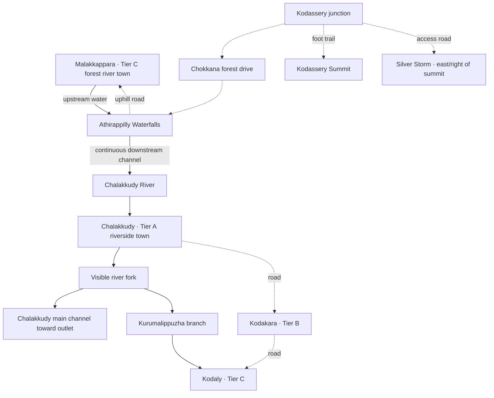

# Kodassery Diaries v2.0 — Design and Delivery Plan

> **For agentic workers:** Use `superpowers:executing-plans` for staged implementation, with explicit bounded GPT-5.6 Luna handoffs after GPT-6 Astra freezes dependencies. Track steps with checkboxes. This is a proposal for review, not a claim of implemented or accepted features.

**Goal:** Build a connected Kerala exploration game organized around forested headwaters, Athirappilly Waterfalls, a branching river, distinct towns, roadside stops, a colorful water park, and a browsable vehicle collection.

**Architecture:** Extend the existing canonical world data and shared terrain/collision pipeline. Town tiers describe settlement scale, not new save-region IDs. Astra owns geography, traversal, asset integration and lifecycle; Luna handles repeatable audits, frozen content data, isolated UI and focused regression coverage.

**Tech stack:** Existing TypeScript, React, React Three Fiber/Three.js, Rapier and Vitest. No new runtime dependency assumed.

**Spec:** The user's 15 September 2026 v2.0 request, elaborated in sections 1–6 here. Carry forward the [mountain/Chokkana/Athirappilly plan](2026-09-15-mountain-chokkana-athirappilly.md), [design bible](../../02-design-bible.md), [architecture](../../03-architecture.md), and [circa-2000 direction](../../07-kerala-2000s-direction.md), with the explicit changes below.

## Global constraints and precedence

- Working public title: **Kodassery Diaries**. “v2.0” is this milestone name; the current package version is `0.1.0`. Do not equate the name with an already shipped 1.0 release.
- No quests, backend, accounts, or multiplayer work in this milestone. Preserve unrelated existing work, including server/packages.
- Preserve existing player profiles, discoveries, original destinations and Silverthread Falls. Do not rename storage keys or package namespaces as a cosmetic branding step.
- Avoid per-frame React state updates; physics owns movement and UI receives snapshots. Use shared UI tokens and world-derived map coordinates.
- User owns looks-and-feel review and supplies screenshots. Ask for review at the gates below; do not spend tokens repeatedly opening browsers, generating screenshot matrices, or independently polishing toward assumed approval.
- Use focused checks during implementation; run the required typecheck, test and build gate once per integrated handoff, repeating only after relevant changes/failures. This planning-only document does not require game tests.
- The new requested river split explicitly supersedes the old plan's instruction not to connect Athirappilly to Kurumali. This is authored game geography, not a claim about real drainage or travel routes.
- Retain the early-2000s setting for towns, signage and scenery. The user's supplied cars, including Fennec, are intentional playable styling exceptions; no Rocket League gameplay is implied.
- Procedural dressing and fitted rigs remain prototype assets. No new work silently completes earlier art, animation, licensing, browser or performance gates.

## 1. Recommended direction

**A river journey through places with different rhythms.** Malakkappara feels cool, enclosed and upstream; Athirappilly opens into a dramatic waterfall; Chalakkudy feels busy and broad; Kodakara is a compact road junction; Kodaly remains intimate beside its river approach. The summit reveals the relationship between them. Silver Storm provides a colorful destination visible through the forest on the right/east side of the summit.

Three possible delivery approaches:

| Approach | Tradeoff | Recommendation |
|---|---|---|
| Finish the current terrain foundations, then extend one connected river-and-road layout | Some core terrain work first; towns and assets then share stable placement | **Choose this.** Best fit for coherent water, driving and map behavior |
| Place all new assets into existing empty land immediately | Faster first pictures; likely rework when riverbeds, roads and footprints change | Useful only for the isolated asset review yard |
| Rebuild the entire map at a much larger scale | More geographic freedom; disrupts saves, existing routes and unfinished work | Defer; extend the current world only where needed |

Keep the existing four-region identity and add named settlement/attraction areas. “Tier A/B/C” is a design/content designation, not an unlock, player level or promise of city simulation. Decide region ownership from final footprints, not solely north/south Z coordinates.

## 2. Geography and town hierarchy

Solid arrows indicate authored water direction; dotted links indicate roads/trails, not water. Fork placement downstream of Chalakkudy is a design proposal. Final X/Z coordinates follow a shared blockout review; these relationships do not assert surveyed geography.

| Place | Proposed playable scale, not total background scenery | Identity and anchors |
|---|---|---|
| Chalakkudy — Tier A | 220–300 m principal street; 18–24 facade/building placements; 2–3 connected street segments | Largest town: bazaar street, small bus stand, coffee shop, riverfront steps/overlook, main bridge and first fuel station. Mix tiled shops and modest concrete buildings |
| Kodakara — Tier B | 120–180 m street sequence; 9–12 placements | Road-junction town with provision shops, bakery, shaded waiting area and an optional second fuel station at its edge |
| Kodaly — Tier C | Existing center adapted to roughly 70–110 m intimate core; 5–8 core placements | Kurumalippuzha arrival and small bazaar. **User confirmed: keep the existing harbor and lighthouse**, with a readable river-to-estuary transition |
| Malakkappara — Tier C | 80–120 m inhabited stretch; 5–8 placements | Small forest river town above/upstream of the falls: narrow bridge, tiled homes, tea shop, roadside shelter, dry river walk and wooded upstream bend |

Counts are initial composition caps, not a requirement to load dozens of unique GLBs. Reuse modest facade kits; trees, water and breathing room should dominate Malakkappara. Tier A must visibly exceed B, and B exceed C, without turning the region into a metropolis.

### Placement rules

- “On top of Athirappilly” means a habitable upstream plateau behind/above the waterfall, not houses sitting on the cliff lip. Bring an uphill road from the falls approach around the escarpment with vehicle-safe gradients.
- “Right of summit” means east/+X in the north-up map for the draft. Start by surveying the area east of the current summit anchor `(-130, -690)`. Do not declare it empty until checking terrain, trail switchbacks, panorama rays and access.
- Silver Storm sits on a broad terrace below the summit skyline, reached by a road spur and parking. Protect the summit's main sightlines; relocate the terrace within this east-side area if the imported park footprint cannot fit.
- Chalakkudy and Kodakara need new footprints outside occupied terrain. Astra first reserves river corridors, roads, bridge approaches and settlement footprints; Luna receives final anchors afterward.
- Preserve the existing Kodaly coastline, harbor and lighthouse, as confirmed by the user during planning. Connect the river branch to this coastal composition.
- Expand bounds from the actual terrain and assets, including the park, upper town, downstream channel and jetty. Never enlarge the map alone over nonexistent ground.

### Water must connect physically and visually

Author a directed river network: upstream reach → waterfall lip → falling curtains → plunge pool → downstream Chalakkudy reaches → fork → main outlet plus Kurumalippuzha branch → Kodaly approach. Join the existing Kurumali corridor through a transition rather than leaving a second disconnected water strip.

Each reach needs a stable ID, name key, centerline, width profile, longitudinal surface heights, flow direction, bank footprint and explicit endpoint connections. Waterfalls are explicit vertical-drop connections. A single constant `surfaceY` polygon cannot represent the entire highland-to-lowland network.

Use authored sloping river ribbons and matching riverbeds/banks; no fluid simulation. Keep water surfaces continuous and non-increasing downstream, including equal heights where branches meet. Animate foam/UV flow in the same direction. Keep natural pools locally level. Eliminate holes, uphill water, hovering ribbons and abrupt visible ends; the main channel needs an authored outlet.

Canonical geometry feeds the renderer, water/access queries, safe spawn validation and both maps. Bridges carry separate collision decks above water. Keep dry banks and viewing areas accessible; no swimming, boating or water-current physics is added here. Maintain the existing crossing constraints where still applicable, adding only explicitly authored bridges for new roads.

## 3. Destinations and roadside life

### Silver Storm

Use `public/park/amusement_park.glb` as the attraction's core. Adapt its materials to an intentional colorful family-park palette: turquoise/blue water, warm yellow, coral and leaf green, with darker supports. Preserve useful textures and separate ride surfaces from concrete/paths. Do not tint the whole scene one color.

First compose entrance/sign, pedestrian route, existing imported attractions, parking and the requested **large side pool**. Propose a 25×15 m pool with a 2–3 m dry deck around it, visible from the approach; reserve a total park site around 100×80 m only as a blockout starting budget. Scale the imported rides from plausible seats/people, then resize the site if necessary rather than shrinking a whole amusement park to fit.

The pool has a bounded basin, clear edge, entry steps as scenery and dry perimeter access. Its water is independent from the river network. Keep it outside playable entry until swimming exists. Static attractions are sufficient for v2.0; functioning rides, ticketing and swimming are separate scope. Avoid opening a ticket/economy feature just because the model contains booths.

### Chalakkudy coffee shop

Use `public/assets/buildings/coffee_shop_isometric.glb`, retaining the building and suitable attached architecture. Remove the presentation plane/base and unrelated diorama geometry **before calculating bounds and scale**. Verify the actual node geometry; do not delete every mesh named `Plane`, since that may remove a wall, roof or sign.

Place it facing the main street near the riverfront turn, with a grounded plinth, reachable doorway/veranda and space for a bench and cycle. First target: a 7–10 m wide building, 2.0–2.3 m door height and believable depth, retaining uniform source proportions. Exterior and approach are in scope; no interior ordering simulation.

### Tea stops and fuel stations

Propose six tea-stop locations in total, counting existing stops: Kadambode/Rajan's existing shop; Chokkana's existing tea stop; summit trailhead or first broad rest shelf; Athirappilly parking; Malakkappara bridge approach; Kodakara road junction. Add at most two more only if the final road still has a long empty stretch. Never place a stall on a narrow summit switchback or inside a vehicle turning corridor.

Reuse a 3–5 m frontage kit with an awning, bench, kettle/tumblers and period painted signs. Variation comes from orientation, roof/material choices and a few props, not many unique models.

Use `public/assets/buildings/low_poly_fuel_station.glb` for one station on the Chalakkudy approach and an optional second on the Kodakara/forest-road junction. Start with a 20×25 m site budget; derive pump/canopy scale from a car and a roughly 3.5 m clear canopy height. Check forecourt turns and exit visibility. Fuel stations are scenery/stopping places; fuel consumption and refueling mechanics are not implied.

## 4. Vehicle collection and Spawn Car flow

The request lists **four** additions, despite saying “three”: `bronco.glb`, `car_carton.glb`, `car.glb`, and `fennec_-_rocket_league_car.glb`. Plan for all four alongside the existing Admin and Classic muscle cars. Other files in the directory are not automatically added to scope.

The current UI already opens a modal with a text selector and Spawn button. Evolve that flow:

1. Click **Spawn Car** to open the collection and pause gameplay through the existing input owner.
2. Browse six labeled cards; selecting a car opens a large 3D preview with optional drag rotation, a clear loading/error state and accessible text selection.
3. Show Bronco paint choices if its materials can support separate body recoloring. Keep tires dark and glass distinct. Default to no automatic preview spin, especially with reduced motion.
4. Click **Spawn selected car**. Spawn the selected configuration on valid nearby drivable ground with full chassis clearance. If blocked, explain it and preserve the current car; do not report success or silently spawn in water/on a foot trail.
5. Retain the current one-spawned-car behavior and mount/dismount controls. Replacing a car is allowed only after a new valid spawn is resolved; disallow replacement while mounted. Car persistence remains unchanged unless separately requested.

Preview only the selected model at full detail. Reuse cached resources safely and release preview-owned resources on close; do not preload all vehicle GLBs into the initial game payload. Preview camera/input must not control the playing camera.

### Vehicle calibration is core work

Current `CarVisual.tsx` requests a 3.8 m length, and `ModelAsset.tsx` additionally caps width at 1.8 m and height at 1.7 m. Physics and wheel mappings currently enumerate only `admin` and `muscle`. Adding four catalog rows alone is therefore insufficient, especially for a taller Bronco.

Use one calibrated vehicle record per model for forward correction, uniform scale, chassis envelope/offset, four wheel centers/radii, front steering assignment, spin axes and mesh groups. Derive physics and visual wheel mapping from the same calibration. Reuse current `CarMotion`; do not create a second independent wheel simulation. Wheel rotation follows signed travel; front steering and suspension displacement follow physical values. A rear-mounted spare stays fixed.

First sizing targets are design proposals: Bronco about 4.2 m long with room for its taller body; other cars roughly 3.6–4.2 m long. Measure width, ground clearance and turning fit against existing roads and the narrow bridge before accepting dimensions. Never nonuniformly squeeze a car to fit a road or reuse another car's wheel centers without measuring.

## 5. Asset intake and sizing contract

All seven requested paths must be checked, including original spelling `car_carton.glb`. Preserve supplied originals. Derived exports, if required, go under `public/assets/derived/` with explicit source records; runtime filtering is acceptable where selective nodes are reliable.

For each asset, perform one reusable intake pass and record: byte size; source/license availability; nodes; mesh/material/texture counts; triangles; embedded animation; transformed bounds; axes; removable presentation geometry; retained geometry; final dimensions; ground pivot; collision proxy; and any unresolved issue. Unknown rights remain unknown, rather than fabricated as approved.

Normalization order: clone safely → isolate retained geometry → apply orientation → compute transformed bounds → apply one uniform scale → center base/pivot → derive collision/placement → apply cloned material overrides. Avoid mutating shared cached source materials, which could recolor other instances and previews.

Use a standard daylight review yard with a 1 m marker, the current avatar, existing car and road width. Ask the user for a screenshot of the batch and request scale/palette approval before scattering copies across the world. Asset scale, building entry height, road clearance and wheel contact are measurable engineering work; aesthetic approval belongs to the user.

If a car's wheels are fused with the body, a source edit or derived GLB separating wheels is an explicit dependency. If coffee-shop presentation geometry is fused with the building, the same applies. Do not hide these cases behind fake spinning overlays, a guessed mesh deletion or a completion claim. For the park, use coarse boundaries/proxies; decorative ride parts do not each need a collider.

## 6. Existing mountain-plan carryover

Read the working tree alongside the build log: the old backlog still says implementation has not started, while several new components are now present. The following is a conservative planning assessment, not fresh test certification.

| Old task | Observed state on 15 September | v2.0 treatment |
|---|---|---|
| MX-A1 spatial contracts | Marked Done in plan/build log; layout and contracts exist | Reuse; extend for towns and connected water |
| MX-L3 panorama helpers | Marked Done; helper and recorded six-test result exist | Reuse; calculate targets for the enlarged world |
| MX-A2 terrain/foundations | Working-tree `expansionGround.ts`, `ExpansionGround.tsx`, `expansionTerrain.ts` and tests exist | Partial: inspect actual seam/contact behavior; replace isolated river assumptions |
| MX-A3 summit | `MountainExpansion.tsx` and mountain test exist | Partial: continuous ascent/descent, safe reset and user feel review remain gates |
| MX-A4 forest drive | `ChokkanaWorld.tsx` exists | Partial: real vehicle envelope, uphill/downhill/loop and travel pacing remain gates |
| MX-A5 falls | `AthirappillyWorld.tsx`, waterfall geometry and tests exist | Partial: upper/lower access and visual review; extend upstream/downstream water |
| MX-L1 place copy | `expansionPlaces.ts` and locale edits/tests exist | Implementation present; reconcile frozen anchors and integration before Done |
| MX-L2 forest placement | `expansionInstances.ts` and tests exist | Implementation present; verify actual exclusions and approved density |
| MX-A6 panorama | `SummitVisibility.tsx` and canvas edits exist | Partial: sightline visibility, distant silhouettes and measured cost unaccepted |
| MX-A7 map/save/access | World, map, app and controller edits exist; new place records are not assembled into canonical `LANDMARKS` | Partial: wire new discoveries/HUD/map records, then verify restore/access behavior |
| MX-L4 independent regressions | Dedicated planned regression/map/save suite not yet evidenced | Add only missing behavior coverage after integration; reuse existing tests |
| MX-A8 final acceptance | No complete expansion runtime/performance acceptance recorded | Carry into final v2.0 engineering gate and user review |

Do not restart implemented work merely because a checklist is stale. Do not mark code-present work Done without the missing evidence. Original art-quality milestones, broad browser coverage and performance acceptance remain separately visible in the build log.

## 7. Delivery tasks and model ownership

All tasks below start **Planned**. Astra alone writes shared contracts, canonical definition, package files, app composition, physics, camera and integration/status documents. Luna workers get exact writable paths plus one relevant contract/fixture; they do not reread the whole repository or choose terrain topology.

### V2-01 — Reconcile baseline and freeze layout · Astra + read-only Luna

**Current status: G1 approved by user, 15 September 2026.** The user reviewed the available inspection destinations and replied “this looks right.” Typed blueprint is implemented in `worldV2.ts`/`v2Layout.ts`, exported as `V2_LAYOUT` separately from live terrain. Positions are accepted for the next terrain stage; final grounded anchors, new collision and safe spawns still belong to V2-02. No new v2 terrain or changed save version is activated yet.

**Files:** Astra: `src/contracts/worldExpansion.ts`, new `src/contracts/worldV2.ts`, new `src/content/world/v2Layout.ts`, `src/content/world/definition.ts`, this plan, `docs/04-task-backlog.md`, `docs/06-build-log.md`. Luna: no writes for the status audit.

- [x] Reconcile MX tasks against actual source and existing evidence; preserve dirty work and original IDs.
- [ ] Freeze settlement/attraction footprints, upstream and downstream endpoints, road connections, bridge sites and ground-derived spawn anchors in canonical data. Keep town IDs distinct from `ZoneId`.
- [x] Add typed reach/connectivity and town-tier records; define shared exports before any dependent handoff. Existing `ExpansionWater` remains suitable for local pools, not the full river elevation profile.
- [x] Present one labeled north-up blockout for user review: tier sizes, east-side park, fork, Malakkappara and retained Kodaly harbor. Resolve footprint feedback before dressing.

**Gate G1:** User accepts layout/composition. Numerical bounds/topology checks establish viable roads and downhill water. No exact draft coordinates become production commitments before this gate.

### V2-02 — River and traversal foundation · Astra

**Current status: Terrain blockout approved by user and committed as `cb09c95`.** User: “Looks good, Commit this and proceed.” Live shared ground now reaches all four new inspection sites. River surfaces/queries/atlas share triangle geometry; riverbeds and dry road benches use the same collision mesh as terrain sampling. New access roads avoid river crossings, so no additional bridge deck is required in this blockout; existing bridge content is preserved. Chalakkudy joins the existing Chokkana road at its southern bend to avoid a conflicting elevated crossing. Buildings, town dressing and park assets remain subsequent stages.

**Depends on:** V2-01. **Writable:** new `src/game/world/RiverNetwork.tsx`, new `src/game/world/riverGeometry.ts`, layout/contracts from V2-01, `src/content/world/expansionGround.ts`, `src/game/world/expansionTerrain.ts`, `traversalGeometry.ts`, `ExpansionGround.tsx`, `AthirappillyWorld.tsx`, `Waterfall.tsx`, `waterfallGeometry.ts`, `KeralaWorld.tsx`, `src/game/player/controllerMath.ts`, `src/game/vehicle/clearance.ts`, `src/game/player/ExplorerController.tsx`, focused `tests/riverNetwork.test.ts` and existing expansion/traversal tests.

- [x] Complete reusable MX-A2 foundations, cut riverbeds/banks into shared terrain and connect upstream → falls → basin → fork/outlets.
- [x] Replace relevant fixed river-strip/height assumptions in water queries with reach geometry; use the same footprints in collision access and map data.
- [x] Connect Malakkappara, settlement sites and Silver Storm by grade-safe roads; retained crossings use existing decks. Keep summit/lower-falls trails foot-only outside the shared road junction.
- [x] Check confluence/fork endpoint agreement, downstream height monotonicity, shared terrain seams, dry spawn clearance and actual Rapier contacts on representative grades. User driving/visual acceptance remains open.

**Gate:** Complete navigable graybox; user reviews one continuous river/falls sequence. Do not scatter buildings while this geometry is unstable.

### V2-03 — Asset intake batch · Luna; adaptation/calibration · Astra

**Current status: Partial — asset yard ready for G2 review.** See [asset intake](../../assets/2026-09-15-v2-intake.md) for precise transformed dimensions and extraction. `/v2-assets.html` previews all seven profiles with metre references and legacy material compatibility. Coffee presentation plane removed; fuel kit trimmed to 17,499 triangles; park helpers/deep skirts removed. Park curation/optimization, Bronco body/wheel separation, rigged-car axes and final collision footprints remain open. No production placement or vehicle registration yet.

**Depends on:** None for inventory; V2-01/02 for placement. **Luna writable:** new `docs/assets/2026-09-15-v2-intake.md` only. **Astra writable:** `src/content/assets/models.ts`, `manifest.ts`, new `src/content/assets/v2AssetProfiles.ts`, `src/game/render/ModelAsset.tsx`, new `src/game/render/EnvironmentAsset.tsx`, derived assets under `public/assets/derived/` when needed.

- [x] Luna inventories each of the seven supplied files once, with machine-readable bounds/node findings summarized in the intake document.
- [ ] Astra isolates the coffee-shop building, prepares per-part park/Bronco materials, fixes axes and normalizes retained geometry; records any required mesh separation.
- [ ] Freeze per-asset dimensions, collision footprint and material/node selectors; reject missing selectors explicitly instead of silently claiming successful adaptation.
- [ ] Present one asset-yard batch to the user for scale/color review.

**Gate G2:** User approves size/palette. Unusable geometry gets a named preparation task; core world work can continue independently.

### V2-04 — Settlement assembly · Astra; placement data · Luna

**Current status: Partial — Chalakkudy first street ready for placement review.** User said “proceed” after the yard handoff; treated as permission to continue a provisional first street, not blanket G2 visual acceptance. Six grounded buildings: supplied coffee shop, tea shop, provision store, bakery and two houses. Conservative coffee shell/floor collision is tied to measured extracted geometry; forecourt/ramp are walkable and the interior stays closed. Pedestrian lane joins the canonical town center; Development inspection includes “Chalakkudy — coffee street.” Full Tier A density, riverfront, other towns and final palette remain open. Park/cars are not brought into the playable scene by this step.

**Depends on:** V2-02/03 and G2. **Astra writable:** new `src/game/world/TownWorld.tsx`, `src/game/world/buildingFoundation.ts`, `src/game/world/KeralaWorld.tsx`, `AthirappillyWorld.tsx`, `RegionalDetails.tsx`. **Luna writable:** new `src/content/world/v2TownPlacements.ts` only, against frozen asset IDs, footprints and door-facing rules.

- [ ] Implement Chalakkudy first as the density/style reference; ground the coffee-shop entrance and riverfront approaches.
- [ ] Populate Kodakara with a smaller junction center; adapt existing Kodaly while preserving accepted landmarks.
- [ ] Build Malakkappara along the upper river with bridge, tea stop and forest clearings; keep the waterfall lip protected.
- [ ] Reuse facade/material kits and exclude doors, footpaths, roads, water and camera corridors from props/trees.

**Gate G3:** User reviews one street-level image per town plus the Malakkappara river view. Tier hierarchy and Kerala atmosphere are the questions, not exhaustive screenshot coverage.

### V2-05 — Silver Storm and roadside stops · Astra; placement data · Luna

**Depends on:** V2-02/03 and G2. **Astra writable:** new `src/game/world/SilverStormWorld.tsx`, new `src/game/world/RoadsideStops.tsx`, `src/game/world/KeralaWorld.tsx`, `buildingFoundation.ts`. **Luna writable:** new `src/content/world/v2RoadsidePlacements.ts` only after dimensions and exclusions are frozen.

- [ ] Place the adapted amusement park on the approved east-side terrace; add pool, dry deck, entrance sign, parking and accessible perimeter.
- [ ] Ground one fuel station; add a second only if the final approach spacing benefits from it.
- [ ] Reuse existing tea stops and add the approved missing stops, including one on the summit approach without blocking the climb.
- [ ] Keep repeated content instanced/shared and coarse collision out of roads, doors and narrow trails.

**Gate G4:** User reviews park color/scale/pool composition and a representative tea/fuel stop. Verify access/clearance with focused existing helpers.

### V2-06 — Four calibrated vehicles · Astra

**Depends on:** V2-03 calibration; independent of town dressing. **Writable:** `src/content/assets/models.ts`, new `src/content/assets/vehicleProfiles.ts`, `src/game/vehicle/CarVisual.tsx`, `carPhysics.ts`, `carWheelAnimation.ts`, `clearance.ts`, `src/game/render/ModelAsset.tsx`, `src/game/player/ExplorerController.tsx`, relevant existing vehicle tests and new `tests/vehicleProfiles.test.ts`.

- [ ] Register all four additions with individually measured transforms/chassis/wheels and keep the existing two cars working.
- [ ] Use cloned material overrides for Bronco paint, wheels/glass untouched; separate unsupported wheel meshes in derived assets if needed.
- [ ] Connect wheel spin/steer/suspension to existing physics values; calibrate radius, center and axis after normalization.
- [ ] Check one representative new vehicle physically on flat ground, grade, braking/reverse and bridge; check each model's unique wheel mapping and clearance. Repeat deeper handling tests only for models with different physical profiles or failures.

**Gate G5:** User reviews all four cars for scale, Bronco paint and tire movement, then provides driving-feel feedback. Static preview approval does not certify wheel animation.

### V2-07 — Browsable car spawner · Luna UI + Astra integration

**Depends on:** V2-06 catalog and frozen callbacks. **Luna writable:** new `src/features/vehicles/CarPicker.tsx`, `src/features/vehicles/car-picker.css`. **Astra writable:** new `src/features/vehicles/CarPreview.tsx`, `src/app/App.tsx`, `src/game/player/ExplorerController.tsx`, `src/game/input/` only as required by existing mode ownership.

**UI boundary:** Luna receives catalog entries, selected ID, selected paint, loading/spawn status, a preview slot, and `onSelect(id)`, `onPaint(color)`, `onSpawn()` and `onClose()` callbacks. UI does not load GLBs, move a rigid body, own pointer lock or change application mode.

- [ ] Luna builds token-styled, keyboard/touch-accessible selection and action controls; include text labels and a clear selected state.
- [ ] Astra supplies lazy selected-car preview with safe lifecycle and wires the existing modal/input owner.
- [ ] Return explicit spawn success/blocked status, retain current car on failure, prevent duplicate click spawns and mounted replacement.
- [ ] Check open → select → spawn and load-failure/blocked-spawn → retry; check Escape/focus restoration and no leaked movement input.

**Gate G6:** User confirms preview usefulness, selection clarity and spawning behavior. No new vehicle-persistence feature is required.

### V2-08 — Map, names, save recovery and title · Astra + bounded Luna

**Depends on:** V2-02 anchors and V2-04/05 places; title copy can start earlier. **Astra writable:** `src/content/world/definition.ts`, `src/features/map/ExplorerMap.tsx`, `mapGeometry.ts`, `src/app/App.tsx`, `src/persistence/localSaveRepository.ts`, `index.html`, `README.md`. **Luna writable:** new `src/content/world/v2Places.ts`, `src/content/locales/en.json`, `ml.json`. One Luna writer owns locale files; picker copy is bundled into this task.

- [ ] Generate landmark/map records from frozen anchors; label Chalakkudy River, Kurumalippuzha, four towns, Silver Storm, coffee shop and useful roadside stops.
- [ ] Draw actual branching river geometry and roads at the same projection as the player; prioritize major town labels at low zoom.
- [ ] Change visible title to Kodassery Diaries, including entry/title metadata. Keep package namespaces/storage identities stable.
- [ ] Bump world version when geometry changes become active; preserve profile/settings/discoveries and validate old positions against loaded terrain/collision before recovery to a dry safe point.
- [ ] Keep untranslated Malayalam entries on the established English fallback, requesting human translations instead of inventing them.

**Gate:** Map matches actual locations; user reviews final atlas/title with G7. Old saves survive without a forced reset.

### V2-09 — Close remaining mountain and panorama gates · Astra

**Depends on:** V2-02/04/05. **Writable:** `src/game/world/MountainExpansion.tsx`, `ChokkanaWorld.tsx`, `AthirappillyWorld.tsx`, `src/game/camera/SummitVisibility.tsx`, `panoramaMath.ts`, `ThirdPersonCamera.tsx`, `src/app/WorldCanvas.tsx`, new `src/game/world/DistantWorld.tsx` only if needed, canonical panorama target data.

- [ ] Complete remaining MX-A3/A4/A5 traversal details using the existing work; preserve the forest loop and lower falls walk.
- [ ] Recompute summit far-plane/fog targets from the expanded world and protect useful views of water, towns and park; retain low-cost distant silhouettes.
- [ ] Request one user route review: summit ascent/descent, Chokkana loop, falls upper/lower views, uphill Malakkappara approach. Ask for timestamps/screenshots only at problems and key views.
- [ ] Tune only reported or measured defects, then request a focused recheck.

**Gate G7:** User approves summit panorama, forest-drive rhythm, waterfall/river continuity and final atlas. No autonomous repeated visual-polish loop.

### V2-10 — Focused regression and final evidence · Luna + Astra

**Depends on:** integrated tasks above. **Luna writable:** new `tests/v2World.test.ts`, `tests/v2Assets.test.ts`, `tests/v2Save.test.ts`; no production files. **Astra writable:** integration fixes within ownership above, `docs/06-build-log.md`, `docs/04-task-backlog.md`, `docs/09-model-handoffs.md`, new `docs/validation/2026-09-15-kodassery-diaries-v2.md`.

- [ ] Luna checks only meaningful gaps: network joins/downstream heights, map bounds/anchor projection, retained old IDs/save recovery, car profile/wheel selector integrity and safe dry spawning. Reuse equivalent existing coverage rather than duplicate it.
- [ ] Astra runs `npm run typecheck`, `npm test`, `npm run build`, and `git diff --check` once on the integrated candidate; fix failures and repeat affected checks.
- [ ] Ask the user to verify the actual running app and provide final route/screenshots. Record review date, build/revision, viewport and quality; screenshots alone do not establish driving feel or frame rate.
- [ ] Take one short measured performance sample at the worst summit/park location on the user's named device if metrics are available. If not measured, explicitly leave performance unverified. Existing architecture budgets remain targets, not passed gates.
- [ ] Record implementation, user acceptance, functional checks and unmeasured limitations separately. Keep any required unfinished gate Partial.

**Done:** Connected requested geography, four visibly differentiated towns, park/pool, supplied buildings/stops, four working added cars and preview/spawn flow, preserved old content/saves, engineering checks passed, and user visual/feel acceptance recorded. Deferred final art or hardware coverage is stated plainly.

## 8. Efficient team workflow and review budget

Recommended order: **V2-01 → V2-02 → V2-04/05 → V2-08/09 → V2-10**. Run the V2-03 intake alongside layout; once asset profiles are ready, work through V2-06 → V2-07 independently of town dressing. Astra integrations remain sequential because shared renderer/controller/composition files overlap.

- **Astra:** topology, terrain, water heights, bridge collision, camera, vehicle calibration, input lifecycle, shared schemas, save compatibility and integration decisions.
- **Luna:** read-once inventories/status tables, deterministic placement records, labels/copy, isolated picker controls, mechanical metadata updates and small contract tests. Escalate fused geometry, uncertain scene ownership or physics decisions to Astra.
- **User:** choose layout/style, inspect running scenes and driving feel, supply screenshots, approve G1–G7 or report specific corrections.

Each Luna assignment supplies: task ID, dependency revision, exact writable files, relevant exported types, one neighboring example, and one focused command if testing is needed. Return only changes/results/blockers. Do not repeatedly send full design documents to every worker or ask several agents to review the same files.

For visual feedback, ask a small concrete question tied to a named view: “Does Malakkappara feel like a small wooded river town?” or “Are Bronco tires aligned while turning?” Wait for the answer before dependent visual duplication; continue independent engineering tasks meanwhile. Acceptance is never inferred from silence.

## 9. Planning record

This proposal was prepared from the current working tree and read-only Luna audits. No game implementation, runtime visual review, typecheck, test suite or build was performed as part of writing it. Existing uncommitted source and asset changes are preserved. See the later asset-audit note for intake findings; all acceptance gates remain open.

### Initial read-only asset audit

All seven supplied paths exist. Approximate file sizes below are source-file sizes, not measured network transfer or runtime memory. Node/material counts come from GLB JSON metadata; geometry appearance and final transformed dimensions still need the V2-03 intake/review.

| File | Approx. MB | Finding and required preparation |
|---|---:|---|
| `bronco.glb` | 0.31 | Six nodes, two meshes, two generic materials, no animations or wheel-named nodes. Inspect primitive/vertex structure before promising independent wheel animation or body-only coloring; mesh separation may be necessary |
| `car_carton.glb` | 11.07 | Explicit four wheel nodes and body/glass/wheel materials. Map wheel pivots and normalize; avoid loading this file into the initial game shell |
| `car.glb` | 3.30 | One mesh, extensive wheel/controller hierarchy, five animations. Determine whether wheel control is skeletal; a named object existing does not prove it contains independently movable wheel geometry |
| `fennec_-_rocket_league_car.glb` | 7.68 | Separate rim/tread nodes and paint material. Group each wheel's parts and measure spin/steer axes |
| `amusement_park.glb` | 31.17 | 4,277 nodes, 1,739 meshes, 94 materials. Isolate usable attractions, normalize transforms, remove unnecessary scene pieces, share/merge compatible materials/geometry and prepare distant detail. Do not send the raw full scene through the car-oriented loader |
| `coffee_shop_isometric.glb` | 0.82 | 79 meshes and 27 materials with building, floor and furniture nodes. Retain building architecture, remove presentation plane/unneeded props, then recompute dimensions |
| `low_poly_fuel_station.glb` | 24.63 | 93 meshes and 33 materials; includes ground, cars and surrounding scene parts. Extract station/pumps/canopy and appropriate signs; use game terrain/forecourt and avoid duplicated decorative cars |

Raw accessor bounds for some models are extreme and are not reliable final world dimensions without hierarchy transforms and retained-node filtering. Do not use those numbers as scale measurements. The park's raw complexity makes optimization a V2-03 dependency, not optional final polish; compare the adapted visible scene with the existing provisional medium-tier budget of 250 draw calls/600k triangles. Batch loading and optimization precede any claim of meeting that budget.

Luna's carryover audit also confirmed that the nine expansion place records exist but are not yet merged into canonical `LANDMARKS`. Include this concrete gap in V2-08 so discoveries, HUD counts and inspection do not remain limited to the original twelve places.
