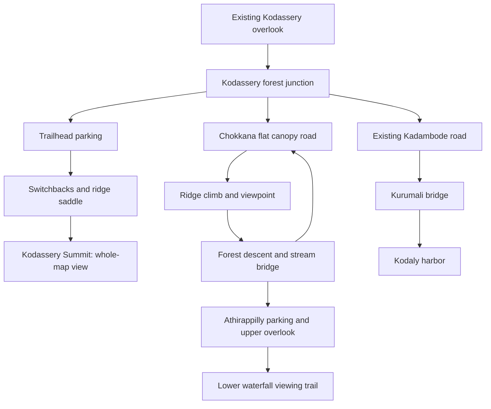

# Kodassery Mountain, Chokkana Forest and Athirappilly Expansion Implementation Plan

> **For agentic workers:** Use `superpowers:executing-plans` to implement this plan task by task; use bounded Luna handoffs below when their dependencies are ready. Steps use checkbox syntax for tracking. This document is a plan, not authorization to claim implementation is complete.

**Goal:** Extend the connected Kerala world with a mountain the player can climb for a whole-map panorama, a scenic Chokkana forest drive, and a separate Athirappilly waterfall destination reached after a meaningful journey from Kodassery.

**Architecture:** Extend the canonical world definition with authored area footprints, routes, water bodies, landmarks and panorama targets. Generate rendered ground, collision and atlas geography from that same data; retain inexpensive distant scenery at the summit. Astra owns terrain, physics, camera, lifecycle and integration; Luna owns bounded data, copy, pure helpers and regression tests after contracts are frozen.

**Tech stack:** Existing React/TypeScript, React Three Fiber/Three.js, Rapier and Vitest; no new runtime dependencies planned.

**Spec:** The user's 15 September 2026 map-expansion request; design detail in sections 1–4 below; existing constraints in [design bible](../../02-design-bible.md), [architecture](../../03-architecture.md), and [Kerala circa 2000 direction](../../07-kerala-2000s-direction.md).

## Global constraints

- No quests, backend, accounts, or multiplayer in this iteration. Preserve any existing unrelated server/package work.
- Avoid per-frame React state updates; physics owns movement and UI receives snapshots.
- Style UI with shared tokens. Keep all map coordinates tied to world data.
- Preserve all four existing regions, twelve landmark IDs, supplied assets, cars, bicycle, controls and saves.
- Procedural scenery remains prototype art; expansion completion does not complete approved GLB/rig/animation milestones.
- Run `npm run typecheck`, `npm test` and `npm run build` before implementation handoff, and inspect the actual running UI. Record unperformed checks honestly.
- Static daytime, early-2000s Kerala materials and signage, no forced camera spin, no stamina/quest mechanics.

## 1. Intended experience

### Kodassery summit: the reward for climbing

Keep the current starting overlook. A visible ridge above it provides a new destination, **Kodassery Summit**. From the existing mountain road, a signposted spur leads to a trailhead with vehicle parking. Players climb on foot through shaded lower switchbacks, a rocky saddle and a final open grass-and-rock ridge. Climbing means a continuous walkable mountain ascent using existing movement, with optional small rock steps; no new wall-climbing, rope, grip or stamina system.

Target a 550–700 m ascent route with about 100–115 m of elevation gain from the existing highland floor, taking approximately 4–6 minutes at a measured walking pace. The first half should have intermittent views; the final ridge reveals the landscape. Provide three resting/viewing shelves, a 2.5–3 m clear trail and a roughly 16×12 m summit terrace. Tune slopes against the actual character controller before dressing the trail. The climb must work without mandatory jumping and the same path must support a safe descent.

The summit is a real position in the world. From its terrace, players can see the original Kodassery forest and Silverthread Falls, Kadambode paddy and temple roof, Kurumali river and bridge, Kodaly lighthouse/harbor/coastal horizon, Chokkana canopy and Athirappilly's cliff and falling water. Compose a broad downhill view containing the major destinations; ordinary player-controlled orbit can inspect the surrounding map. “Whole-map view” means all destination areas and their defining silhouettes are visible from the summit, not every ground surface beneath trees or every building facade. Do not substitute the atlas, a painted skybox of unrelated geography or a cutscene for this reward.

Keep foreground cliff edges readable. Use natural rock boundaries and short railings at narrow viewing shelves, with a grounded safe reset near the summit. No automatic teleport to the peak; development fixtures may spawn there only for testing.

### Chokkana: a drive with changing rhythm

A new signed junction branches from Kodassery into **Chokkana Forest**. The first section is a relatively flat shaded avenue with dappled light, drainage edges and occasional clearings. It then climbs along broad bends to **Chokkana Ridge Bend**, opens onto a valley view, and descends through denser forest toward a stream crossing and the Athirappilly approach. Add a short return connector to make a forest loop; the falls road remains a distinct onward branch.

Design the main forest road for both supplied cars, bicycle and walking. Start with 5–5.5 m paved width, 0.75 m shoulders, curve radii of at least 14 m at the centerline, sustained grades of 3–8%, and no more than 10% on short road sections. These are gameplay design targets, not surveyed local road standards. Test the actual car turning envelope before freezing bends. Use long vertical transitions at crests and dips so the suspension does not launch or bottom out during a normal scenic drive. Flat sections should include at least one continuous 120 m stretch with grade below 2%.

Aim for 0.9–1.2 km along the road from the Kodassery junction through Chokkana to waterfall parking. At a measured scenic speed of 6–9 m/s this gives approximately 2–3 minutes of driving, excluding stops; walking should take roughly 7–10 minutes after measuring the current controller. Distances create separation without a loading teleport. Each 100–150 m should offer a bend, stream, light change, clearing, sign, or view; avoid a long repetitive tree corridor.

Tall broadleaf canopy, ferns, bamboo clumps, exposed roots and mossy rock establish the forest. Keep banana/pepper planting near inhabited margins and reserve coconut-heavy scenery for lower settled areas. Use existing imported trees where visually appropriate, deterministic placement, shared materials and instancing. Keep trunks and low branches outside the swept vehicle/camera corridor.

### Athirappilly: a new destination

**Athirappilly Waterfalls** is separate from the existing `waterfall` landmark, Silverthread Falls. Preserve that ID, name and discovery history. New IDs identify the Athirappilly destination and its lower viewing point.

Reference a broad stepped rock escarpment with several water curtains, a visible upstream river, a deep downstream pool and forested banks. Athirappilly is on the Chalakudy River at the entrance to the Sholayar ranges; the real fall is approximately 80 feet high. Use that identity as visual grounding, with a stylized 24–28 m drop and a 55–70 m wide rock face as a first game blockout. The game width is a design choice, not a claimed real measurement. Sources: [Kerala Tourism](https://www.keralatourism.org/destination/athirappalli-vazhachal-waterfalls/79/) and [Thrissur district administration](https://thrissur.nic.in/en/tourist-place/athirappilly-waterfall/).

Arrival sequence: forest bend → modest parking/tea stall → upper overlook → optional 120–180 m descending pedestrian trail → lower side-on viewing terrace. Water sound and mist suggest the destination before the complete falls become visible. Upper and lower viewing areas stay outside the water and lip collision zones. No swimming mechanic is required. The downstream river continues visibly out of the playable basin; do not falsely label it Kurumali or connect the two rivers merely to reuse the existing water strip.

Use painted foam, layered low-cost water surfaces, restrained spray and distance-based audio. At low quality, reduce spray and foliage but preserve the waterfall silhouette and movement. Reduced-motion settings suppress decorative motion consistent with the existing waterfall. Any new audio asset needs recorded provenance; synthesized preview audio must be labeled as such and respect existing mute/volume/pause behavior.

## 2. Layout and landmarks

This is a compressed, Kerala-inspired world, not a geographically accurate road map. Chokkana's road layout and the junction sequence below are game composition choices, not claims about real travel routes. Keep the original four major region IDs; add Chokkana and Athirappilly as named **areas under the Kodassery highland region**, each with its own footprint and label. This avoids pretending the four-region save schema is already a six-region system.



Initial blockout envelope: X approximately `[-680, 100]`, Z approximately `[-760, 92]`. Preserve existing coordinates in the original corridor and extend mostly west/north, leaving the harbor coastline intact. This supersedes the old 166×576 m target only for this expansion. Compute final bounds from authored geometry, including the jetty; do not stretch the original terrain and move its landmarks.

| Landmark / stable new ID | Initial X,Z anchor | Experience and access |
|---|---|---|
| Kodassery Forest Junction / `kodassery-junction` | -8,-446 | Painted direction board, laterite shoulder, links old road to new branch |
| Summit Trailhead / `summit-trailhead` | -65,-490 | Flat parking and small tiled shelter; separate clear walking entrance |
| Kodassery Summit / `kodassery-summit` | -130,-640 | Starting height target Y≈185–195 m; panoramic terrace above all nearby ridges |
| Chokkana Forest / `chokkana-entry` | -170,-450 | Shaded flat avenue and modest forest-entry board |
| Chokkana Ridge Bend / `chokkana-ridge` | -320,-545 | Uphill road reward, valley sightline and vehicle pull-off |
| Chokkana Stream Bridge / `chokkana-stream` | -435,-420 | Short stone/concrete bridge, flowing stream, downstream footpath |
| Chokkana Tea Stop / `chokkana-tea-stop` | -275,-420 | Tiled roof, timber bench, steel tumblers and period painted board on return loop |
| Athirappilly Upper View / `athirappilly-falls` | -585,-455 | Parking nearby; broad waterfall reveal from dry ground |
| Athirappilly Lower View / `athirappilly-lower-view` | -595,-365 | Separate accessible trail terminus outside spray pool |

Anchors are design seeds. Astra may shift new anchors during blockout to satisfy gradients, lengths, sightlines and collision; freeze final positions before Luna authors dependent data. Derive heights from the final rendered terrain/deck surface, never from these approximate Y targets alone. New landmark descriptions and map names must resolve through localization catalogs; retain blank Malayalam fallback until reviewed translations are available.

## 3. Current code constraints and proposed boundaries

Observed starting point: `WORLD_BOUNDS` is 166×576 m; `getZoneAt(z)` divides the world into north–south strips; `isWater` treats all X>83 as sea; terrain generation uses fixed north/south grids; atlas land shapes contain fixed strip cuts; camera far plane is 480 m and fog ends at 285 m. Simply adding markers or making the old terrain taller cannot produce this expansion.

| Files | Responsibility / owner |
|---|---|
| `src/contracts/worldExpansion.ts` (new) | Area, route, landmark-seed and panorama contracts; Astra |
| `src/content/world/expansionLayout.ts` (new) | Frozen footprints, route centerlines, anchor positions, water polygons and summit targets; Astra |
| `src/content/world/definition.ts` | Canonical assembly, bounds, area/region resolution, water/access and safe-ground queries; Astra |
| `src/game/world/expansionTerrain.ts` (new), `traversalGeometry.ts` | Terrain chunks and shared rendered/collision sampling; Astra |
| `src/game/world/MountainExpansion.tsx`, `ChokkanaWorld.tsx`, `AthirappillyWorld.tsx` (new) | Regional scene components; Astra |
| `src/game/world/Waterfall.tsx`, `waterfallGeometry.ts` | Parameterized waterfalls retaining Silverthread defaults; Astra |
| `src/game/world/expansionInstances.ts` (new) | Deterministic decor placements against frozen exclusion footprints; Luna |
| `src/content/world/expansionPlaces.ts` (new), `src/content/locales/en.json`, `ml.json` | Landmark copy and locale entries; Luna |
| `src/game/camera/panoramaMath.ts` (new) | Pure distance/fog blend calculations; Luna |
| `src/game/camera/SummitVisibility.tsx` (new), `ThirdPersonCamera.tsx`, `src/app/WorldCanvas.tsx` | Camera/fog integration and distant terrain visibility; Astra |
| `src/features/map/ExplorerMap.tsx`, `mapGeometry.ts` | Shared area polygons and route display, keyboard/touch behavior; Astra integration |
| `src/game/player/ExplorerController.tsx`, `controllerMath.ts`, `src/app/App.tsx`, `src/persistence/localSaveRepository.ts` | Access, area labels, lifecycle and save recovery integration where needed; Astra |
| Dedicated `tests/expansion*.test.ts`, `tests/panoramaMath.test.ts` | Bounded new regression coverage; Luna, then Astra review |

Astra freezes the following interface before any dependent Luna code task. Keep contracts separate from implementation to avoid circular imports between definition, layout and content.

```ts
import type { Landmark, MapBounds, Vec3, ZoneId, TravelMode } from './index';
export type AreaId = 'kodassery-summit' | 'chokkana' | 'athirappilly';
export interface ExpansionArea {
  id: AreaId;
  zoneId: ZoneId; // 'kodassery' for these three areas
  footprint: readonly (readonly [number, number])[]; // X,Z polygon
  labelPosition: readonly [number, number];
}
export interface ExpansionRoute {
  id: string;
  points: readonly Vec3[]; // final surface positions, not guessed heights
  widthM: number;
  allowedModes: readonly TravelMode[];
}
export interface ExpansionAnchor {
  id: string;
  areaId: AreaId;
  position: Vec3;
  discoveryRadiusM: number;
  iconId: Landmark['iconId'];
}
export interface ExpansionLayout {
  bounds: MapBounds;
  areas: readonly ExpansionArea[];
  routes: readonly ExpansionRoute[];
  anchors: readonly ExpansionAnchor[];
  summitPosition: Vec3;
  panoramaTargets: readonly Vec3[];
}
```

Exports: `createExpansionLayout({ junction, panoramaTargets })` from `expansionLayout.ts`; canonical `EXPANSION_LAYOUT: ExpansionLayout` from `definition.ts`; `EXPANSION_PLACES: Landmark[]` from `expansionPlaces.ts`. Proposed canonical queries: `getAreaAt(x:number,z:number): AreaId | null`, `getZoneAtPosition(x:number,z:number): ZoneId`, `isTravelAllowed(mode:TravelMode,x:number,z:number): boolean`. Preserve `getZoneAt(z)` as legacy behavior only until all spatial callers are migrated; grep all call sites, including tests. Foot-only status requires actual entrance geometry/vehicle checks; an atlas label alone does not stop a dynamic car.

## 4. Summit visibility and performance strategy

Keep low-detail terrain, canopy masses, river ribbons, waterfall faces and destination silhouettes resident across the full expanded map. Render nearby foliage/buildings at existing quality; reduce distant meshes, materials and shadows. Do not duplicate overlapping terrain surfaces or place colliders on distant visual substitutes. First implementation may retain simplified collision for all traversable chunks if profiling permits; split decorative residency before introducing unnecessary streaming machinery.

Calculate a far plane from the summit to every world-envelope corner, using min/max terrain elevations and margin, rather than replacing 480 with another arbitrary constant. Start with at least 15% beyond the farthest distance. Fog must leave all destination targets readable. Blend local forest fog to summit visibility based on elevation/proximity using frame refs; keep one sun and warm/cool palette. Reduced motion uses an immediate stable setting, without a cinematic camera move.

Terrain rays from the summit eye position to designated silhouette samples must be unobstructed; also inspect actual screenshots because ray tests do not detect every visual issue. Move intervening ridges or open tree sightlines before increasing summit height indefinitely. At each quality tier, the player should identify the falls, coastal lighthouse, river crossing, paddy valley and forest ridge without debug markers.

Use architecture budgets: medium 1440×900, DPR≤1.5, median≤16.7 ms and p95≤25 ms on the named standard device; low 1280×720 p95≤33.3 ms on the named lower-tier device; medium ≤250 draw calls and ≤600k triangles. These remain targets, not current measured results. Profile summit and forest separately for 60 seconds after warmup, and repeat travel to detect retained-resource growth. Existing large imported assets and bundle warnings remain an independent constraint.

## 5. Task tracker and execution order

Only planning tasks are done at creation. Implementation boxes below stay unchecked until behavior, tests and required visual evidence pass. Status vocabulary: **Planned → Ready → In progress → Review → Done**, or **Blocked** with a named dependency. Use **Partial** when code exists but a required playtest remains. Record actual status in `docs/06-build-log.md`; update this table and the backlog pointer in the same handoff.

| ID | Owner | Dependencies | Deliverable | Status |
|---|---|---|---|---|
| MX-P1 | Astra | None | Inspect existing design, geography, rendering and task status | Done |
| MX-P2 | Luna | P1 | Read-only regression/handoff review | Done |
| MX-P3 | Astra | P1, P2 | Write and reconcile expansion plan/backlog/handoffs | Done |
| MX-A1 | Astra | P3 | Freeze spatial contracts and blockout layout | In progress |
| MX-A2 | Astra | A1 | Shared terrain, road surfaces, water and seamless connections | Planned |
| MX-L1 | Luna | A1, A2 final anchors | Landmark records and locale copy | Planned |
| MX-A3 | Astra | A2 | Playable mountain ascent/descent | Planned |
| MX-A4 | Astra | A2 | Chokkana drive and loop | Planned |
| MX-A5 | Astra | A2 | Separate Athirappilly waterfall and trails | Planned |
| MX-L2 | Luna | A2, A4 exclusions | Deterministic forest decor placements | Planned |
| MX-L3 | Luna | A1 | Pure panorama math | Done |
| MX-A6 | Astra | A3, A4, A5, L2, L3 | Whole-map summit rendering and sightlines | Planned |
| MX-A7 | Astra | L1, A3, A4, A5 | Atlas, discovery, access and save integration | Planned |
| MX-L4 | Luna | A6, A7 | Independent content/map/save regression tests | Planned |
| MX-A8 | Astra | All implementation tasks | Full route/visual/performance verification and evidence | Planned |

Core tasks are sequential with a single Astra writer. While Astra develops A3–A5, Luna can work on L1/L3; L2 starts after exclusions settle. Do not dispatch two Luna tasks that write the same catalog/test. Astra is the sole writer of package files, composition, contracts, canonical definition and status documents.

### MX-A1 — Spatial contracts and blockout layout

**Writable:** `src/contracts/worldExpansion.ts`, `src/content/world/expansionLayout.ts`, `src/content/world/definition.ts`, `tests/world-topology.test.ts`, new `tests/expansionLayout.test.ts`.

- [ ] Add the contracts above, nine anchors and area polygons; retain existing zone and landmark IDs.
- [ ] Author route points to meet the 550–700 m summit and 0.9–1.2 km waterfall-road targets; record computed lengths/elevation profiles in the build log.
- [ ] Implement polygon-based area and X/Z region lookup with deterministic seam ownership; retain original coordinate behavior outside the expansion.
- [ ] Test points sharing Z but belonging to old corridor versus Chokkana; test polygon edges, unique IDs, finite coordinates and connection to the old route.
- [ ] Freeze layout exports and record the reviewed file revision for Luna. Do not declare A1 done while later paths lack a viable slope profile.

**Gate:** `npx vitest run tests/world-topology.test.ts tests/expansionLayout.test.ts`; typecheck. Existing four-region behavior must remain covered while obsolete strip-only assumptions are updated explicitly.

### MX-A2 — Terrain, water and road foundations

**Writable:** `src/game/world/expansionTerrain.ts`, `traversalGeometry.ts`, `src/content/world/definition.ts`, `expansionLayout.ts`, `src/game/world/KodasseryWorld.tsx`, `KeralaWorld.tsx`, `src/game/player/controllerMath.ts`, new `tests/expansionTerrain.test.ts`, existing `tests/traversal.test.ts` and `tests/foundationAccess.test.ts`.

- [ ] Generate explicit non-overlapping original/expansion terrain chunks and render/collide the same triangle arrays; preserve original terrain heights and building approaches.
- [ ] Form trail and road benches into the mesh with smooth blends to hills, road shoulders and the stream bridge. Sample final heights from triangles for spawns/landmarks.
- [ ] Author Athirappilly pool/upstream/downstream water polygons independently of Kurumali and the sea; use the same footprints for map and water queries.
- [ ] Add joining geometry and collision before allowing travel into any new chunk. Confirm both directions across every seam with actual Rapier capsule and vehicle contacts.
- [ ] Test mesh winding, finite vertices, shared-edge heights, bridge approach clearance and restored safe ground. Recheck original temple, houses, bridge and quay.

**Gate:** focused terrain/traversal/foundation tests, live wireframe/collision review, no gaps, doubled floors or floating road ribbons.

### MX-A3 — Mountain ascent and summit

**Writable:** new `src/game/world/MountainExpansion.tsx`, new `tests/expansionMountain.test.ts`, terrain/layout paths from A2, `src/game/world/KeralaWorld.tsx`, `src/content/world/definition.ts`.

- [ ] Build the trailhead, continuous switchbacks, three rest shelves and summit terrace at the frozen route positions.
- [ ] Add natural edge protection and vehicle-excluding trail entrances while preserving pedestrian clearance. Register dry, grounded reset points at trailhead and summit.
- [ ] Run real capsule ascent and descent using existing movement, without teleporting between samples or raising slope limits globally.
- [ ] Walk the climb in the live UI using normal controls; record elapsed time and any camera occlusion at turns. Confirm full descent and safe reset after a deliberate fall.

**Gate:** both-direction traversal test passes; real playable climb/descent recorded. Panorama is accepted separately in A6.

### MX-A4 — Chokkana driving route

**Writable:** new `src/game/world/ChokkanaWorld.tsx`, new `tests/expansionDriving.test.ts`, terrain/layout paths from A2, `src/game/world/KeralaWorld.tsx`, `src/content/world/definition.ts`, `src/game/player/ExplorerController.tsx`. Car motor changes, if evidence requires them, remain Astra-owned in `src/game/vehicle/carPhysics.ts` with existing car regression suites.

- [ ] Build flat avenue, uphill ridge bends, downhill section, stream bridge, return loop and pull-offs; publish decor exclusion polygons.
- [ ] Check road width and full car swept envelope at bends, including suspension travel and camera clearance. Remove roadside collisions from drivable shoulders.
- [ ] Test both supplied cars uphill, downhill, stopped on a grade, reversing at a pull-off and braking into a bend. Also ride the bicycle and walk the loop.
- [ ] Validate physical grade transitions without warping the chassis or flattening suspension. Keep sprint/nitro from bypassing trail restrictions or falling through chunk edges.
- [ ] Check that cliffs, riverbanks and road layout prevent an unintended short drive straight across the forest to the falls; retain free exploration on safe pedestrian ground.
- [ ] Drive the entire junction-to-falls route manually; record travel time and tune route pacing without imposing artificial slow zones just to meet the timer.

**Gate:** actual car bodies traverse in both directions; no forced jumps, chassis bottoming at normal scenic speeds or inaccessible return path. Human steering feel requires a manual pass in addition to target-following tests.

### MX-A5 — Athirappilly scene

**Writable:** new `src/game/world/AthirappillyWorld.tsx`, `Waterfall.tsx`, `waterfallGeometry.ts`, `src/game/world/KeralaWorld.tsx`, `src/game/audio/AudioDirector.tsx`, `src/content/assets/manifest.ts`, terrain/layout paths from A2, new `tests/expansionWaterfall.test.ts`, existing `tests/waterfallGeometry.test.ts`.

- [ ] Parameterize waterfall placement/shape without changing Silverthread defaults. Build broad curtains, escarpment, upstream ribbon and downstream basin.
- [ ] Build modest arrival parking, upper overlook, descending footpath and lower dry terrace. Ground the tea stall using the existing foundation helper.
- [ ] Add restrained quality-aware foam/mist and optional sourced/localized sound; preserve existing BGM/settings lifecycle.
- [ ] Test separate footprints/IDs, dry accessible viewpoints, continuous trail collision and no discovery trigger reachable only inside water.
- [ ] Inspect the arrival reveal, upper/lower views and Silverthread regression at low/medium/high quality and reduced motion.

**Gate:** travel from Kodassery reaches a visibly distinct destination; both viewing areas work on foot; original falls remain intact.

### MX-A6 — Whole-map summit view

**Writable:** `src/game/camera/SummitVisibility.tsx`, `ThirdPersonCamera.tsx`, `src/app/WorldCanvas.tsx`, new `src/game/world/DistantWorld.tsx`, regional scene/terrain files, new `tests/expansionSightlines.test.ts`.

- [ ] Use L3 distance/blend helpers to derive far plane and summit fog settings; update Three.js camera projection correctly when far changes.
- [ ] Build a distant representation from canonical terrain/water/landmark geometry; retain all destination silhouettes on low quality and restrict shadows to nearby geometry.
- [ ] Test terrain line-of-sight from summit eye height to all authored panorama targets; adjust ridges and canopy gaps where blocked.
- [ ] Inspect a broad downhill overview and an ordinary player-controlled orbit from the summit. Capture labeled evidence linking visible silhouettes to the atlas.
- [ ] Verify camera collision, pause/resume, map close, reduced motion and approach/departure from the fog blend zone; no clipping or abrupt reveal.

**Gate:** every original region and both new destination areas are identifiable in the real scene; screenshot evidence and A8 performance measurements required before final completion.

### MX-A7 — Atlas, discovery and save integration

**Writable:** `src/features/map/ExplorerMap.tsx`, `mapGeometry.ts`, `src/content/world/definition.ts`, `src/app/App.tsx`, `src/game/player/ExplorerController.tsx`, `src/persistence/localSaveRepository.ts`, `tests/mapGeometry.test.ts`, `tests/persistence.test.ts`, `tests/world-topology.test.ts`.

- [ ] Assemble L1 landmarks and derive region landmark lists. Show Chokkana/Athirappilly area names in the map and current-location text while retaining the four major regions.
- [ ] Replace fixed strip decorations that imply false geography with authored area/water polygons; draw loop/branches and foot-only summit/falls trails distinctly using existing tokens.
- [ ] Include every playable point and existing jetty in map bounds; preserve aspect ratio instead of squeezing a wide world into the old narrow map shape.
- [ ] Migrate spatial callers from Z-only region checks; wire travel permission to vehicle handling and contextual messages as well as map legend.
- [ ] Increment world version when terrain becomes active. Preserve old discovery IDs/profile/settings; validate old positions on loaded collision and relocate invalid ones to dry safe spawns without deleting saves.
- [ ] Inspect keyboard landmark selection, touch waypoints, pan/zoom, minimap/player alignment, labels, new discoveries and reload at trailhead/summit/forest/falls.

**Gate:** map and world agree, old saves recover, new locations persist, foot-only routes reject vehicles, four original destinations remain reachable.

### MX-A8 — Final verification and handoff

**Writable:** fix files owned by Astra as evidence requires; `docs/06-build-log.md`, this plan, `docs/04-task-backlog.md`, `docs/09-model-handoffs.md`, new `docs/validation/2026-09-15-map-expansion.md` and screenshots under `docs/validation/map-expansion/`.

- [ ] Run `npm run typecheck`, `npm test`, `npm run build`, `git diff --check`; report exact totals and warnings.
- [ ] Inspect actual running app, not a detached scene alone: original spawn → summit ascent/descent → Chokkana loop → Athirappilly upper/lower views → original village/bridge/harbor.
- [ ] Repeat new drivable route in both cars and bicycle; test pause/map/blur, mount/dismount, reset, reload and English/Malayalam fallback. Verify pedestrian paths on touch as well as desktop.
- [ ] Capture summit overview, flat road, uphill bend, downhill/stream bridge, falls arrival/lower view and full atlas at named viewport/quality settings.
- [ ] Measure summit and forest performance against section 4; name hardware/browser. Mark unavailable hardware checks untested and retain Partial status if they are required gates.
- [ ] Review new asset provenance and prototype-art limitations. Update each task only against its own evidence; record unresolved issues instead of declaring expansion complete.

## 6. Copyable Luna handoffs

All handoffs use **GPT-5.6 Luna**. Before dispatch, Astra supplies the completed dependency revision and verifies exported contracts match this document. If a named interface is absent, Luna reports that dependency and stops dependent work. Workers do not update status documents; Astra updates status after review.

### MX-L1 — Landmark data and localized copy

**Depends on:** A1 and A2, including final anchors. **Only writable:** `src/content/world/expansionPlaces.ts`, `src/content/locales/en.json`, `src/content/locales/ml.json`, `tests/expansionPlaces.test.ts`.

Read `Landmark`, `EXPANSION_LAYOUT`, existing locale format and `translate.ts`. Export `EXPANSION_PLACES: Landmark[]` by mapping the nine frozen anchors to the names/descriptions in sections 1–2; use `zoneId: 'kodassery'`. Never retype coordinates. Add matching English locale entries and blank Malayalam entries using the established fallback. Preserve Silverthread's ID and entries. Copy must describe scenery/access, not invented quests or unverified historical claims.

- [ ] Implement records and catalog entries.
- [ ] Test exact anchor-ID coverage, positions equal to source anchors, locale-key parity, no old ID collision and English fallback for blank Malayalam.
- [ ] Run `npx vitest run tests/expansionPlaces.test.ts tests/i18n.test.ts`; return changed paths and actual results for Astra integration.

### MX-L2 — Forest placement data

**Depends on:** A2 and A4 frozen terrain/exclusions. **Only writable:** `src/game/world/expansionInstances.ts`, `tests/expansionInstances.test.ts`.

Export the following pure helper. Astra supplies polygon predicates built from final road, trail, parking, water and summit-view exclusions; Luna does not design terrain or collision.

```ts
export interface ForestInstance {
  position: [number, number, number];
  yawRad: number;
  scale: number;
}
export function createForestInstances(input: {
  seed: number;
  count: number;
  bounds: { xMin:number; xMax:number; zMin:number; zMax:number };
  heightAt: (x:number,z:number) => number;
  allowedAt: (x:number,z:number) => boolean;
}): ForestInstance[];
```

- [ ] Implement deterministic finite placements with at most `count * 20` attempts; return fewer instances when space is unavailable, never loop forever. Invalid count/bounds must throw `RangeError`.
- [ ] Test identical seed equality, different seed variation, complete exclusion returning an empty list, finite ground heights and no accepted forbidden points.
- [ ] Run `npx vitest run tests/expansionInstances.test.ts`; return results. Astra plugs this data into instancing and reviews actual density/collision.

### MX-L3 — Panorama distance helpers

**Depends on:** A1 contracts. **Only writable:** `src/game/camera/panoramaMath.ts`, `tests/panoramaMath.test.ts`.

Export `requiredFarPlane(eye:readonly number[], targets:readonly (readonly number[])[], margin:number):number` and `summitBlend(height:number,start:number,end:number):number`. Require finite three-component vectors, nonempty targets, margin≥1 and end>start; throw `RangeError` on invalid input. Return `max(distance(eye,target))*margin`, clamped to at least 1 m. For blend, clamp normalized height to [0,1], then return `t*t*(3-2*t)`. No React, Three.js, runtime fog mutation or package edits.

- [x] Add failing numerical tests, then implement the functions.
- [x] Include `requiredFarPlane([0,0,0],[[3,4,0]],1.2) === 6`; blend below/above limits is 0/1 and midpoint is 0.5; reject NaN and reversed bounds.
- [x] Run `npx vitest run tests/panoramaMath.test.ts`; return results. Astra supplies world-envelope corners and actual summit activation conditions in A6.

### MX-L4 — Independent expansion regressions

**Depends on:** A6 and A7 reviewed exports. **Only writable:** `tests/expansionRegression.test.ts`, `tests/expansionMap.test.ts`, `tests/expansionSave.test.ts`.

Use actual canonical exports and the existing save/projection test patterns. No production edits. If a test reveals a bug, return the reproduction to Astra; do not weaken assertions to match a broken layout.

- [ ] Check all nine new and twelve existing landmark IDs remain unique; new dry viewing/spawn positions resolve inside area/map bounds.
- [ ] Round-trip projection for original harbor, summit and Athirappilly; test pointer letterboxing on portrait and landscape viewports, and player/waypoint coincidence at known anchors.
- [ ] Test old-world saves retain profile/discoveries/settings and restore to validated ground; test an invalid new cliff/water position uses safe fallback. Follow repository APIs and fixtures without inventing a second persistence layer.
- [ ] Test foot-only summit/lower-falls access rejects bicycle/car while the Chokkana road permits them; check same-Z area classification at separate X values.
- [ ] Run `npx vitest run tests/expansionRegression.test.ts tests/expansionMap.test.ts tests/expansionSave.test.ts`; return failures and results, with no visual-performance claims.

## 7. Completion evidence template

For every task, append to the build log: task ID; owner/model; changed files; behavior delivered; exact checks/results; screenshot or playtest evidence when required; remaining limitations. Then check its steps and set **Done** only if its gate passed. If implementation passes tests but manual driving or summit visibility is unverified, retain **Partial** and identify the missing gate.

Planning completion means this document, dependency ordering, handoff boundaries and status links have been reviewed. It does **not** mean that any new mountain, forest, road or waterfall is playable.

## Planning completion — 15 September 2026

- [x] MX-P1: existing design, canonical world, terrain, atlas and camera inspected.
- [x] MX-P2: GPT-5.6 Luna completed a read-only review covering topology/save compatibility, climb traversal, summit visibility, travel separation, water, suspension, route parity and performance. Findings are incorporated into the task gates.
- [x] MX-P3: plan, backlog pointer and model handoffs reconciled; coverage checked against every requested destination and experience.
- Implementation: **0 of 12 tasks complete** (eight Astra tasks and four Luna tasks). No runtime source edits in this planning pass.
- Baseline checks: typecheck PASS; 412 tests in 70 files PASS; production build PASS. Existing Three.js CommonJS deprecation and large WorldCanvas chunk warnings remain. These checks validate the starting app, not the unbuilt expansion.
- Current app title screen and rendered Kodassery background visually inspected in live Chrome. Expansion traversal, panorama and performance remain untested because no expansion code was implemented.

## Implementation rulings — 15 September 2026

- Start sequentially with MX-A1. Keep active world bounds, collision, discovery list and save version unchanged until MX-A2 provides ground; otherwise the intermediate build would advertise unreachable places. Area lookup may describe the authored expansion without enabling access.
- A1 route elevations are authored design profiles. A2 conforms rendered/collision terrain to those profiles and finalizes grounded anchors; L1 waits for that result. This resolves the plan’s requirement for final surface coordinates before terrain exists.
- Work on `feature/map-expansion` in the shared checkout, preserving the existing uncommitted planning documents and the separate multiplayer worktree. No automatic commits or changes to that other worktree.
- Integration audit: MX-A2 must update `controllerMath.ts` when activating new ground, because the existing reset guard enforces old bounds and one global water height. MX-A7 must migrate App/map/audio region queries to X/Z lookup; source scan identified `AudioDirector.tsx` as an additional bounded Astra integration file.
- MX-A1 interface decision: construct the layout through `createExpansionLayout({ junction, panoramaTargets })`; export the assembled `EXPANSION_LAYOUT` from `definition.ts`. This single-sources the original junction height/position and existing panorama landmarks without introducing a definition/layout import cycle. Luna imports the canonical singleton from `definition.ts`.
